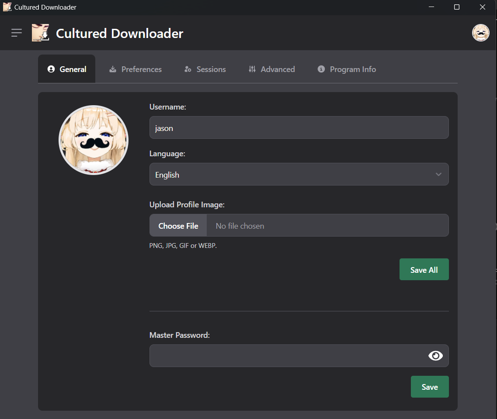
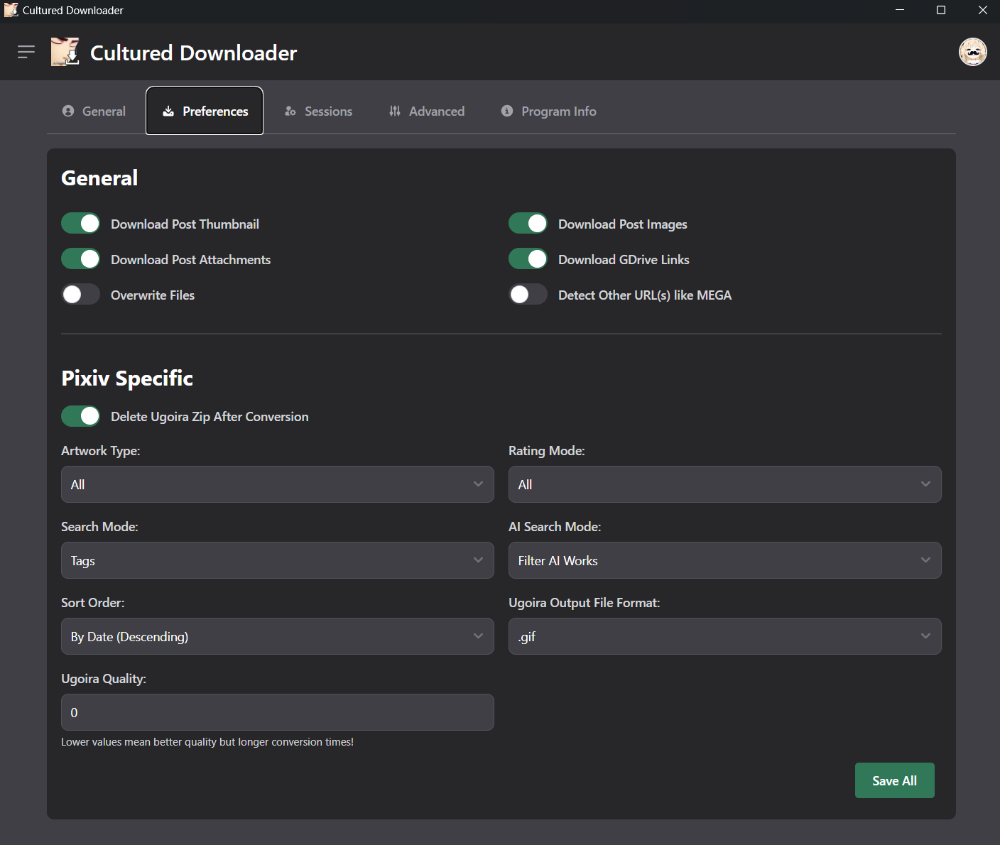
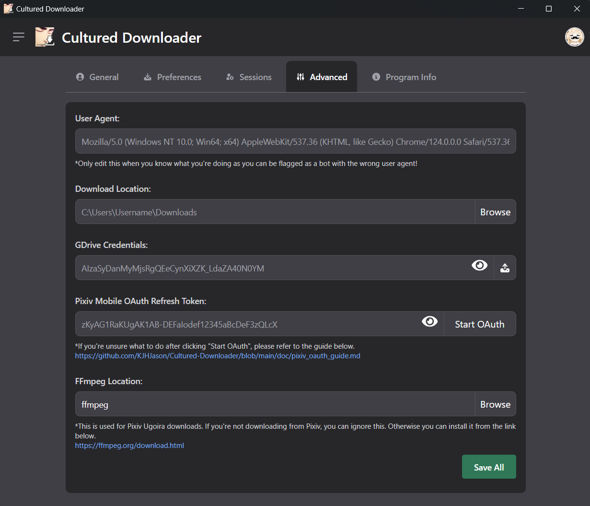
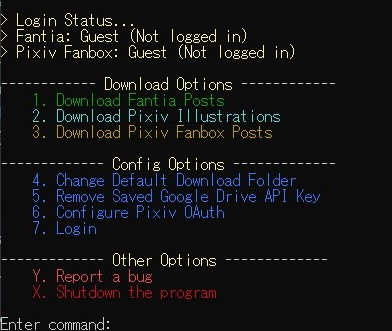
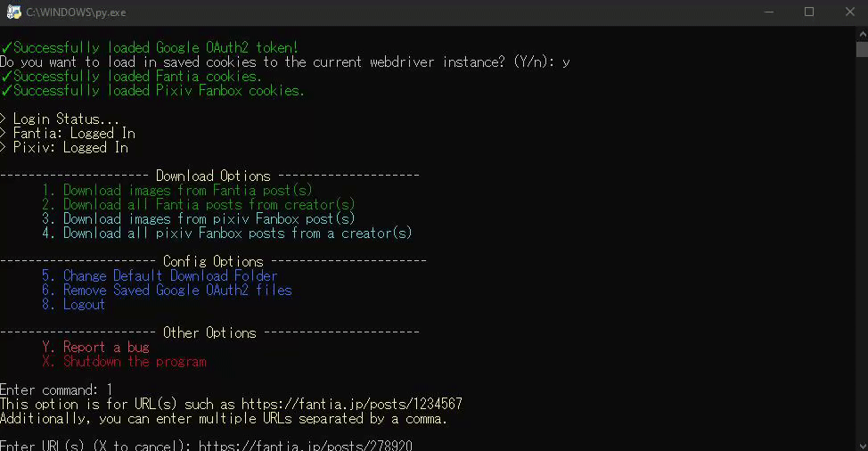
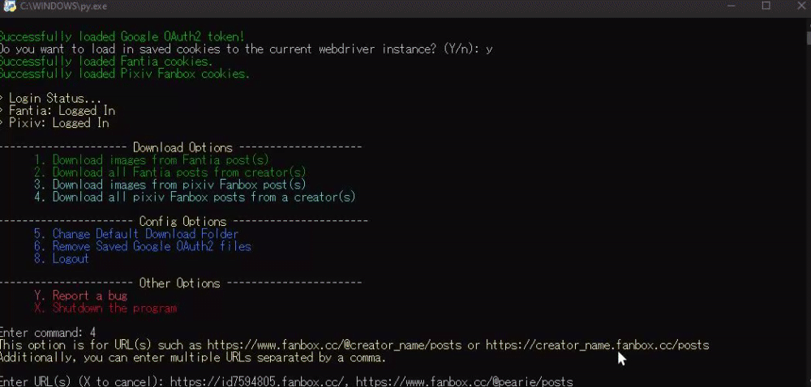

<h1 align="center">

 
Cultured Downloader
</h1>

    
    
    
    
    
    

    <a href="README.md">English</a>
    <a href="README.jp.md">日本語</a>

---

## 目次

- [目次](#目次)
- [はじめに](#はじめに)
- [スター数の推移](#スター数の推移)
- [始め方](#始め方)
- [利用規約](#利用規約)
- [特徴](#特徴)
- [使用上の注意](#使用上の注意)
- [FAQ](#faq)
- [最後のメモ](#最後のメモ)
- [デモ](#デモ)
- [オリジナルのPythonプログラム](#オリジナルのpythonプログラム)

## はじめに

このプログラムは、Fantia、Pixivなどの対応ウェブサイトから画像や添付ファイルなどを自動的にダウンロードすることができます。手動でダウンロードする手間を省くことができます。

私は、一部のアーティストがzipファイルを提供していない場合に、画像を手動でダウンロードするのにうんざりしていたため、このプロジェクトを始めました...

したがって、ウェブスクレイピングを使用して投稿から画像を自動的にダウンロードするプログラムを作成しました。

最終的に、Pythonで初期のプログラムを開発するのに約1ヶ月かかりました。その間に、ウェブスクレイピング、非同期処理、スレッドなどの概念を学びました。

Go/Golangを学んだ後、このプログラムをGolangで書き直し、wailsを使用してGUIを追加し、Svelteをフロントエンドフレームワークとして使用することにしました。

## スター数の推移

<a href="https://star-history.com/#KJHJason/Cultured-Downloader&Date">
  <picture>
    <source media="(prefers-color-scheme: dark)" srcset="https://api.star-history.com/svg?repos=KJHJason/Cultured-Downloader&type=Date&theme=dark" />
    <source media="(prefers-color-scheme: light)" srcset="https://api.star-history.com/svg?repos=KJHJason/Cultured-Downloader&type=Date" />
    
  </picture>
</a>

## 始め方

1. .goファイルの実行
   - このリポジトリをクローンする/このリポジトリのすべてのファイルをダウンロードしてください。
   - [Go/Golang](https://go.dev/dl/)と[Node.js](https://nodejs.org/en/download/)の最新バージョンをインストールしてください。
   - Wails CLIをインストールするには、`go install github.com/wailsapp/wails/v2/cmd/wails@latest`を実行してください。
   - Wails CLIのインストール時に問題が発生した場合は、[Wailsのドキュメント]((https://wails.io/docs/next/gettingstarted/installation#installing-wails))を参照してください。
   - このリポジトリのルートディレクトリで`wails build`を実行してバイナリをビルドし、プログラムを実行できます。
   - 代わりに、開発モードでプログラムを実行するには、wails devを実行できます。
2. 実行可能ファイルの実行
   - [リリースページ](https://github.com/KJHJason/Cultured-Downloader/releases)から最新のCultured Downloader実行可能ファイル（.exe）をダウンロードしてください。
     - `x86_64`や`arm64`が何を意味するかわからない場合は？それはシステムのアーキテクチャであり、`x86_64`はさまざまなシステムのアーキテクチャの中で最も一般的なアーキテクチャです。
       - 注：`x86_64`は一部のシステムで`x64`または`amd64`としても知られています。
     - 実行可能ファイルをダウンロードする前に、システムのアーキテクチャを確認してください。たとえば、Apple M1 Macは`arm64`アーキテクチャを使用しています。
   - ダウンロード後、セキュリティ上の理由から、ダウンロードした実行可能ファイルのSHA256ハッシュとリリースノートで提供されているハッシュを比較して、整合性チェックを行うことができます。
     - たとえば、`_checksum_windows_x86_64-628b21a1b0dbf33a1137432e0f350e5c4bd49ecac9fa2f8a261555433967d394`には、Windows x86_64実行可能ファイルのSHA256ハッシュが含まれています。
       - 64文字の`628b21a1b0dbf33a1137432e0f350e5c4bd49ecac9fa2f8a261555433967d394`は、実行可能ファイルのSHA256ハッシュです。
       - また、単純にテキストファイルとして開くこともでき、SHA256チェックサムが含まれています。  
   - 最後に、プログラムの実行をお楽しみください！

## 利用規約

1. このプログラム、Cultured Downloaderは、いかなる損害についても責任を負いません。このプログラムは個人の使用を目的としており、様々なウェブサイトから画像を手動でダウンロードする時間を節約するために作成されました。

2. このプログラムのユーザーとして、対応ウェブサイトの利用規約に違反しないでください。

3. このプログラムのユーザーとして、クッキーファイルなどのデータを他の人と共有しないでください。これは許可されていません。ダウンロードしているアーティストに損害を与える可能性があるためです。自分のデータを共有したり、他の人のデータを使用したりすることが発覚した場合、このプログラムや開発者は損害の責任を負いませんが、関係するユーザーは責任を負います。

4. このプログラムを使用することで、上記の利用規約に同意するものとします。利用規約に同意しない場合は、リポジトリにアクセスしたり、ソースコードを編集したり、このプログラムを使用することは許可されません。

5. 英語のオリジナル版とこの日本語翻訳の間に不一致がある場合は、オリジナルの英語版が優先されます。

## 特徴

- 将来のダウンロードのためにセッションクッキーなどの必要なデータの保存ができます。
- 以下から画像や添付ファイルをダウンロードができます：
  - Fantia
  - Pixiv Fanbox
  - Pixiv
  - Kemono
- より高速なダウンロードのための同時ダウンロード
  - 注：他のウェブサイトはダウンロード速度を制限するか、制限するため、これはFantiaでより顕著です。
- 以下の投稿からGDriveリンクをダウンロードができます：
  - Fantia
  - Pixiv Fanbox
  - Kemono
  - 注：GDriveのダウンロードにはGoogle Cloud PlatformからのAPIキーが必要です。
    - 不明な場合は、[ガイド](doc/google_api_setup_guide.md)を参照してください。
- MEGA、Dropboxなどの他のURLを検出し、参照用にログに記録します。
- .zipファイルなどの添付ファイルのパスワードを検出し、参照用にログに記録します。
- Pixivのウゴイラを.gif、.apng、.webp、.webm、.mp4などの使いやすい形式に変換するために[FFmpeg](https://ffmpeg.org/)を使用します。

## 使用上の注意

1. このプログラムは個人の使用を目的としており、様々なウェブサイトから画像を手動でダウンロードする時間を節約するために作成されました。ウェブサイトの利用規約に違反することなく、このプログラムを使用しないでください。

2. プログラムにセッションクッキー情報を入力することが不安である場合、続行してダウンロードすることはできません。ただし、安心してください。プログラムは決してシステム外に機密情報を送信しません！

3. 機密データ、例えばセッションクッキーなどは、マスターパスワードを提供することで安全に暗号化できます。しかし、さらに安全を確保するために、暗号化されたデータを他の誰かと共有しないでください。
   - このプログラムは、機密データを暗号化するために[XChaCha20-Poly1305](https://datatracker.ietf.org/doc/html/draft-irtf-cfrg-xchacha-03)暗号化を使用しています。

4. ウェブサイトのフロントエンドデザインやAPIが変更された場合、このプログラムはメンテナンス/更新されていない場合に壊れる可能性があります。この場合、[issue](https://github.com/KJHJason/Cultured-Downloader/issues)を起こしていただければ、できるだけ早く修正するように対応いたします。

## FAQ

1. これは macOS や Linux などの他の OS プラットフォームでも機能しますか?
   - このプログラムはWindowsとLinux（Ubuntu）でのみテストされていますが、他のLinuxディストリビューションやmacOSでも動作するはずです。
2. プログラムが突然終了/クラッシュします。 どうすればいいですか？
   - これは、Go/Golangのエラー処理方法によるものです。致命的なエラーが発生すると、プログラムは`panic`を起こし、自動的に終了します。
   - ただし、エラーを再現する手順を含めて、[issue](https://github.com/KJHJason/Cultured-Downloader/issues)を開いてください。その際に、できる限り修正するよう努めます。

## 最後のメモ

1. このプログラムは個人的な使用を想定していますので、ご了承ください。
2. バグがある場合は、[issue](https://github.com/KJHJason/Cultured-Downloader/issues)を作成していただければ、修正に最善を尽くします。それ以外の場合は、リポジトリをフォークして[プルリクエスト](https://github.com/KJHJason/Cultured-Downloader/pulls)を作成してバグを修正することもできます。
3. このプログラムを改良したい場合は、このリポジトリをフォークし、必要な変更を行い、[プルリクエスト](https://github.com/KJHJason/Cultured-Downloader/pulls)を作成してください。その後、私がそれを見て、良い貢献であると感じればマージします。
4. このプロジェクトのサポートを検討していただき、ありがとうございます。こちらから[コーヒー](https://ko-fi.com/dratornic)をご購入いただくか、[GitHubスポンサー](https://github.com/sponsors/KJHJason)としてサポートすることができます。
   - 皆様の貢献は、このプロジェクトの持続可能性を確保するのに役立ちます。お読みいただき、ありがとうございます。&lt;3

## デモ

  
Fantia投稿からのファイルのダウンロードとダウンロードキューの管理

  

  
一般的な設定

  

  
環境設定

  

  
高度な設定

  

## オリジナルのPythonプログラム

  
メニュー

  

  
投稿ページのURLからファイルをダウンロードする

  

  
複数のクリエイターと複数の投稿からファイルをダウンロードする

  

