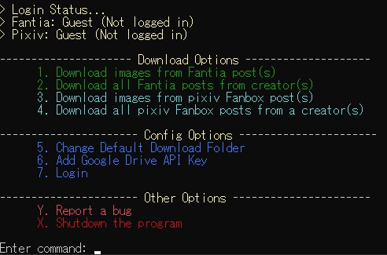
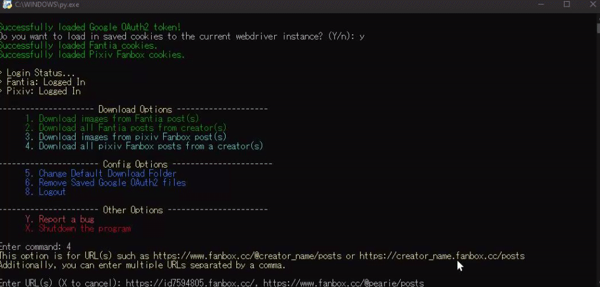

<h1 align="center">

<br>
Cultured Downloader
</h1>

<div align="center">
    <a href="https://github.com/KJHJason/Cultured-Downloader/releases">
    
  </a>
  <a href="https://github.com/KJHJason/Cultured-Downloader/issues">
    
  </a>
  <a href="https://github.com/KJHJason/Cultured-Downloader/pulls">
    
  </a>
</div>

<div align="center">
  <a href="#introduction">English</a>
  <a href="#お知らせ">日本語</a>
</div>

---

## Table of Contents/目次
[English](#introduction)
- [Table of Contents/目次](#table-of-contents目次)
- [Introduction](#introduction)
- [Running the Program](#running-the-program)
- [Terms of Use](#terms-of-use)
- [Features](#features)
- [Usage Notes](#usage-notes)
- [FAQ](#faq)
- [Final Notes](#final-notes)
- [Demo](#demo)
- [お知らせ](#お知らせ)
---

## Introduction
This program allows you to download images from a pixiv Fanbox or Fantia post automatically without you doing the hassle of downloading them yourself.

I did this project as I was tired of downloading images manually as some artists do not provide zip files...

Hence, I coded this program to automate the process of downloading images from a post via web scraping.

In the end, I spent about a month doing this project while learning concepts such as web scraping, async, threading, and more.

## Running the Program

1. Running the Python scripts
   - Download all the files in this repository.
   - Install [Python 3.9.0 or above](https://www.python.org/downloads/)
   - You can install all dependencies by running the command below or let the program install them for you.
     ```
     pip install -r requirements.txt
     ```
   - Run [launcher.py](src/launcher.py) or [cultured_downloader.py](src/cultured_downloader.py) and enjoy!

   Note: You can enjoy automatic updates by running [launcher.py](src/launcher.py) instead of [cultured_downloader.py](src/cultured_downloader.py) which will download the latest release Python files. 

   However, if you face any connection errors, you can pass in the `--skip-update` or `-s` argument to skip the update *check* in both [launcher.py](src/launcher.py) and [cultured_downloader.py](src/cultured_downloader.py)

2. Running the executable file
   - IMPORTANT: This is only for Windows users! For other OS platform, you will have to run the Python scripts instead of the executable file so you can ignore this section and refer to the one above.
   - Download the latest Cultured Downloader executable file from the [releases page](https://github.com/KJHJason/Cultured-Downloader/releases)
   - Once downloaded, you can do integrity check by comparing the SHA256 hash of the downloaded zip file with the hash provided in the release notes.
   - Finally, you can enjoy running the program!

## Terms of Use
1. This program, Cultured Downloader, is not liable for any damages caused. This program is meant for personal use and to save time downloading images from pixiv Fanbox and Fantia manually.

2. As a user of this program, please do not use this program to  break any of Fantia's or pixiv Fanbox's Terms of Service/Terms of Use.

3. As a user of this program, you must never share any data such as your cookie files to other people. This is not permissible as it may cause damages to the artists that you are downloading from. If you have been found to be sharing YOUR data or using OTHER people's data, this program and the developer(s) will not be liable for the damages caused but the user(s) involved will be.

## Features
* **Allow multiple URLs input by separating URLs with a comma**

* **Allow downloads of attachments such as videos, psd, etc.**

* **Allow downloads of gdrive links (for Pixiv Fanbox only)**
  * Note: Requires an API key from Google Cloud Platform for GDrive downloads to work. 
    * Refer to my [guide](doc/google_api_key_guide.md) if unsure.

* **2 Types of download options on both Fantia and Pixiv Fanbox!**
  * Downloading from post URL(s)
    - Fantia URL example: "https://fantia.jp/posts/1234567"
    - Pixiv Fanbox URL example: "https://www.fanbox.cc/@creator_name/posts/1234567"
  * Downloading from multiple posts from creator's page(s)
    - Fantia URL example: "https://fantia.jp/fanclubs/1234/posts"
    - Pixiv Fanbox example: "https://www.fanbox.cc/@creator_name/posts"

## Usage Notes
1. **This program is meant for personal use and to save time downloading images from pixiv Fanbox and Fantia manually. Please do not use this program and break any of Fantia's or pixiv Fanbox's Terms of Service/Terms of Use.**

2. If you feel unsafe signing in to this program with your accounts, you can proceed as a guest. However, you might not be able to download posts that requires a membership.

3. The cookies saved will be encrypted and stored in the configs folder. However, please do not share any data with anyone as they may still be able to decrypt the encrypted cookies if you have shared the key file as well.
   * If you have saved your key on Cultured Downloader API, you *should* be fine but it still not recommended to share your data with anyone as they might be able to decrypt the encrypted cookies and hijack your account.

4. If the website design has been changed, you can expect this program to break if it is not maintained/updated. In this case, please raise an issue and I will take it a look at it and hopefully fix it as soon as possible.

## FAQ
1. Does this work on other OS platforms such as macOS and Linux?
    * This program has only been tested on Windows and Linux (Ubuntu). However, it should work on other Linux distros and macOS as well.

## Final Notes
1. Please remember that this was meant to be a mini-project which is meant to be used for personal use.
2. I am still an amateur in programming so if there is a bug, you can raise an issue and I will do my best to fix it. Otherwise, you can fork this repository and make a pull request to fix the bug if you would like to do so.
3. If you would like to improve on this program, you can fork this repository and do the necessary changes and make a pull request. I will then review it and merge it I feel that it is a good contribution.
4. Though, I may or may not maintain this program depending on the workload I have as a student.

## Demo

<div align="center">
  <p>Menu</p>
  <p></p>
  <p>Downloading files from a post page URL</p>
  <p></p>
  <p>Downloading files from multiple posts from multiple creators</p>
  <p></p>
</div>

---

## お知らせ

残念ながら、翻訳するとしたら、ほとんどDeepLを使うことになるので、日本語のサポートは外しました。

ただし、このプログラムを翻訳したい方は、リポジトリへのコントリビューションを歓迎します。
