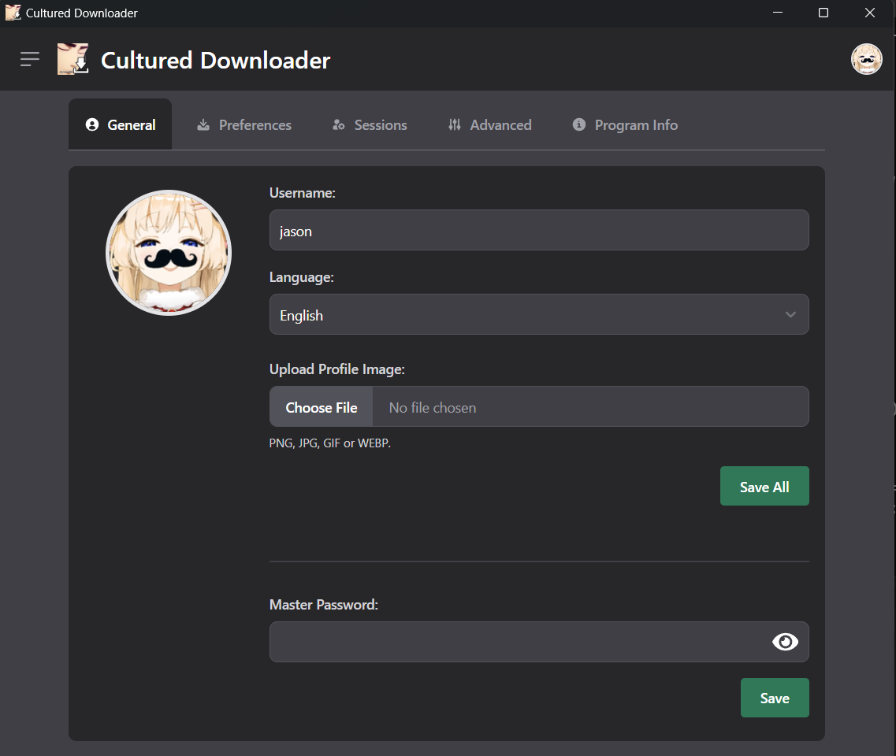
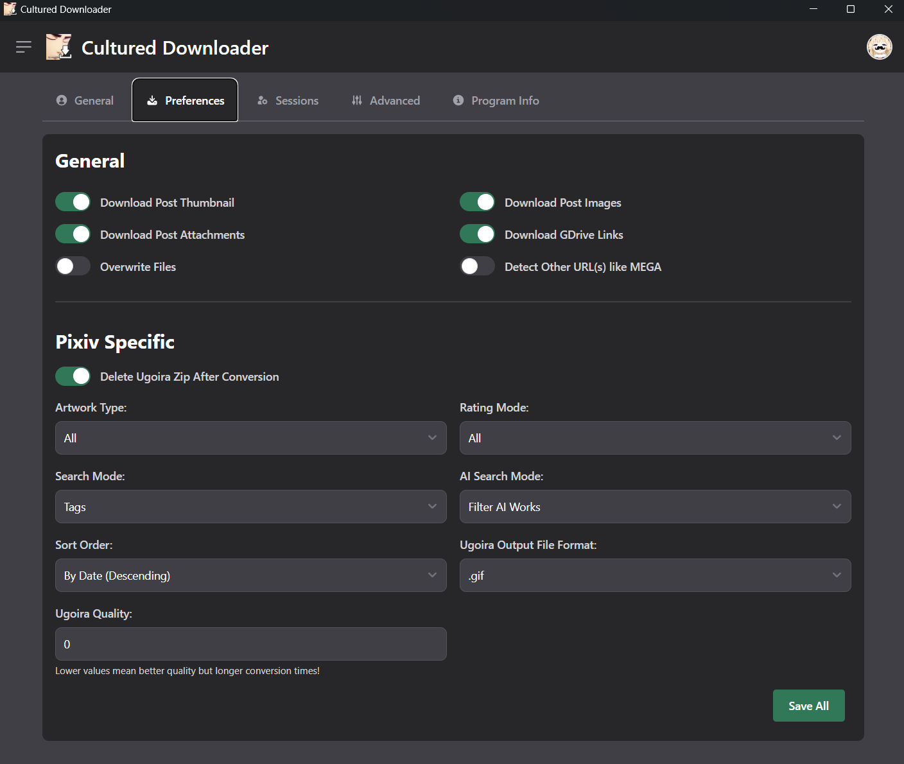
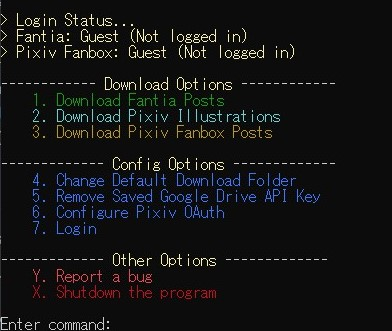
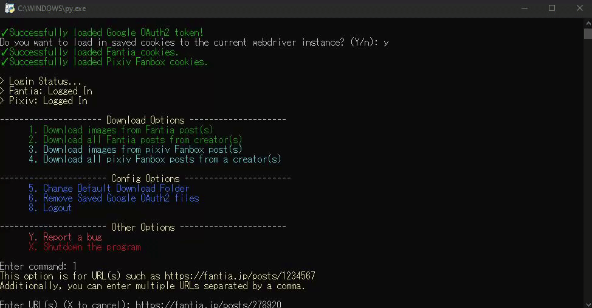

<h1 align="center">

 
Cultured Downloader
</h1>

    
    
    
    
    

    <a href="#introduction">English</a>
    <a href="#お知らせ">日本語</a>

---

## Table of Contents/目次

[English](#introduction)
- [Table of Contents/目次](#table-of-contents目次)
- [Introduction](#introduction)
- [Star History](#star-history)
- [Running the Program](#running-the-program)
- [Terms of Use](#terms-of-use)
- [Features](#features)
- [Usage Notes](#usage-notes)
- [FAQ](#faq)
- [Final Notes](#final-notes)
- [Demo](#demo)
- [The Original Cultured Downloader](#the-original-cultured-downloader)
- [お知らせ](#お知らせ)
---

## Introduction

This program allows you to download files like images and attachment automatically without you doing the hassle of downloading them yourself from supported platforms like Fantia, Pixiv, and more!

I did this project as I was tired of downloading images manually as some artists do not provide zip files...

Hence, I coded this program to automate the process of downloading images from a post via web scraping.

In the end, I spent about a month doing developing the initial program in Python while learning concepts such as web scraping, async, threading, and more.

After learning [Go/Golang](https://go.dev) however, I decided to rewrite the program in Golang with a GUI using [wails](https://wails.io/) with [Svelte](https://svelte.dev/) as the frontend framework.

## Star History

<a href="https://star-history.com/#KJHJason/Cultured-Downloader&Date">
    <picture>
        <source media="(prefers-color-scheme: dark)" srcset="https://api.star-history.com/svg?repos=KJHJason/Cultured-Downloader&type=Date&theme=dark" />
        <source media="(prefers-color-scheme: light)" srcset="https://api.star-history.com/svg?repos=KJHJason/Cultured-Downloader&type=Date" />
        
    </picture>
</a>

## Running the Program

1. Running the .go files
   - Clone this repository/Download all the files in this repository.
   - Install the latest version of [Golang](https://go.dev/dl/) and [Node.js](https://nodejs.org/en/download/)
   - Install the Wails CLI by running `go install github.com/wailsapp/wails/v2/cmd/wails@latest`
     - Refer to the [Wails documentation](https://wails.io/docs/next/gettingstarted/installation#installing-wails) if there is any issues faced when installing the Wails CLI. 
   - Run `wails build` in the root directory of this repository to build the binary and run the program.
     - Alternatively, you can run `wails dev` to run the program in development mode. 

2. Running the executable file
   - Download the latest Cultured Downloader executable file (.exe) from the [releases page](https://github.com/KJHJason/Cultured-Downloader/releases)
   - Once downloaded, you can do an integrity check for security reasons by comparing the SHA256 hash of the downloaded executable file the hash provided in the release notes.
   - Finally, you can enjoy running the program!

## Terms of Use

1. This program, Cultured Downloader, is not liable for any damages caused. This program is meant for personal use and to save time downloading images from the various platforms manually.

2. As a user of this program, please do not use this program to break any of the platform's Terms of Service/Terms of Use.

3. As a user of this program, you must never share any data such as your cookie files to other people. This is not permissible as it may cause damages to the artists that you are downloading from. If you have been found to be sharing YOUR data or using OTHER people's data, this program and the developer(s) will not be liable for the damages caused but the user(s) involved will be.

4. By using this program, you agree to the terms and conditions stated above. If you do not agree to the terms and conditions, you are not permitted to for the repository, edit the source code, or use this program.

## Features

*WIP
* **Allow multiple URLs input by separating URLs with a comma**

* **Allow downloads of attachments such as videos, psd, etc.**

* **Allow downloads of gdrive links (for Pixiv Fanbox only)**
  * Note: Requires an API key from Google Cloud Platform for GDrive downloads to work. 
    * Refer to my [guide](doc/google_api_key_guide.md) if unsure.

* **2 Types of download options on both Fantia and Pixiv Fanbox!**
  * Downloading from post URL(s)
    - Fantia URL example: "https://fantia.jp/posts/1234567"
    - Pixiv Fanbox URL example: "https://www.fanbox.cc/@creator_name/posts/1234567"
  * Downloading from multiple posts from creator's page(s)
    - Fantia URL example: "https://fantia.jp/fanclubs/1234/posts"
    - Pixiv Fanbox example: "https://www.fanbox.cc/@creator_name/posts"

## Usage Notes

1. **This program is meant for personal use and to save time downloading images from the various platforms manually. Please do not use this program and break any of the platform's Terms of Service/Terms of Use.**

2. If you feel unsafe entering your session cookie information to the program, you can proceed as a guest. However, you may be rate-limited or may not be able to download posts that requires a membership.

3. Sensitive data like your session cookie can be encrypted at rest by providing a master password. However, please do not share any data with anyone as they may still be able to decrypt the encrypted sensitive files if you have shared your master password.
    - Note: The program uses [XChaCha20-Poly1305](https://datatracker.ietf.org/doc/html/draft-irtf-cfrg-xchacha-03) encryption to encrypt the sensitive data.

4. If the platform's frontend design or API has been changed, you can expect this program to break if it is not maintained/updated. In this case, please raise an issue and I will take it a look at it and hopefully fix it as soon as possible.

## FAQ

*WIP
1. Does this work on other OS platforms such as macOS and Linux?
    * This program has only been tested on Windows and Linux (Ubuntu). However, it should work on other Linux distros and macOS as well.

## Final Notes

1. Please remember that this was meant to be a mini-project which is meant to be used for personal use.
2. I am still an amateur in programming so if there is a bug, you can raise an issue and I will do my best to fix it. Otherwise, you can fork this repository and make a pull request to fix the bug if you would like to do so.
3. If you would like to improve on this program, you can fork this repository and do the necessary changes and make a pull request. I will then review it and merge it I feel that it is a good contribution.
4. Though, I may or may not maintain this program depending on the workload I have as a student.

## Demo

  
Downloading files from a Fantia post and managing the Download Queues

  

  
General Settings

  

  
Preferences

  

  
Advanced Settings/p>
  

## The Original Cultured Downloader

  
Menu

  

  
Downloading files from a post page URL

  

  
Downloading files from multiple posts from multiple creators

  

---

## お知らせ

*WIP
残念ながら、翻訳するとしたら、ほとんどDeepLを使うことになるので、日本語のサポートは外しました。

ただし、このプログラムを翻訳したい方は、リポジトリへのコントリビューションを歓迎します。
